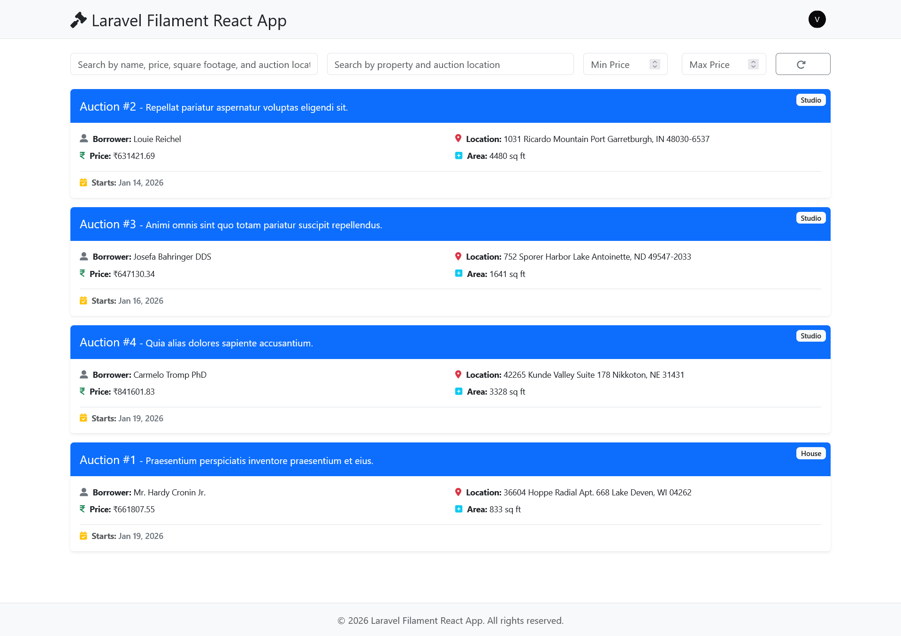
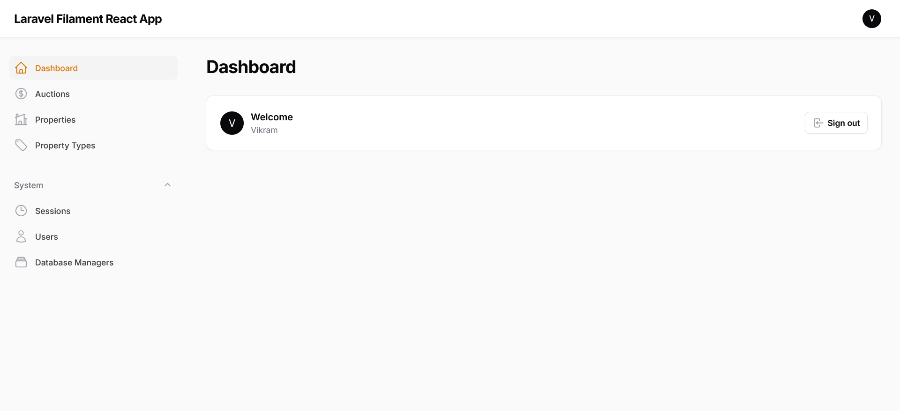

# Laravel Filament React App - Property Auction Application

A full-stack property auction management system built with Laravel 12, Filament 3.3, and React 19. This application provides a comprehensive admin panel for managing properties, auctions, users, and includes a React-based frontend for public-facing features.

## 📸 Screenshots

### Front React App



The React-based frontend provides a modern, responsive user interface for browsing auctions and properties.

### Admin Dashboard



The Filament admin panel provides a clean, modern interface for managing all aspects of the application, including auctions, properties, users, and system settings.

## 🚀 Tech Stack

- **Backend**: Laravel 12
- **Admin Panel**: Filament 3.3
- **Frontend**: React 19 with React Router
- **Authentication**: Laravel Sanctum (API) & Session-based (Web)
- **Database**: MySQL/SQLite
- **Asset Compilation**: Laravel Mix with Webpack
- **Styling**: Tailwind CSS 4.0, Bootstrap 5.3
- **Additional**: JWT Auth, DomPDF, Excel Export

## 📋 Prerequisites

Before you begin, ensure you have the following installed on your system:

- **PHP** >= 8.2 with the following extensions:
  - BCMath
  - Ctype
  - cURL
  - DOM
  - Fileinfo
  - JSON
  - Mbstring
  - OpenSSL
  - PCRE
  - PDO
  - Tokenizer
  - XML
- **Composer** (PHP dependency manager)
- **Node.js** >= 18.x and **npm** (or **yarn**)
- **Database Server** (MySQL 5.7+ / MariaDB 10.3+ / PostgreSQL 10+ / SQLite 3.8.8+)
- **Git**

### Optional but Recommended:
- **Laravel Sail** (Docker-based development environment)
- **NPM/Node.js** for frontend asset compilation

## 📦 Installation

Follow these steps to set up the project locally:

### 1. Clone the Repository

```bash
git clone <repository-url>
cd laravel-filament-react-app
```

### 2. Install PHP Dependencies

Install all PHP dependencies using Composer:

```bash
composer install
```

If you encounter memory issues during installation, you can increase the memory limit:

```bash
php -d memory_limit=-1 /usr/bin/composer install
```

### 3. Install JavaScript Dependencies

Install all Node.js dependencies:

```bash
npm install
```

### 4. Environment Configuration

Create a `.env` file from the example (if `.env.example` exists):

```bash
cp .env.example .env
```

If `.env.example` doesn't exist, create a `.env` file manually. You'll need to configure the following key variables:

```env
APP_NAME="Laravel Filament React App"
APP_ENV=local
APP_KEY=
APP_DEBUG=true
APP_URL=http://localhost:8000

# Database Configuration
# setup for SQLite by default
DB_CONNECTION=sqlite
DB_HOST=127.0.0.1
DB_PORT=3306
DB_DATABASE=laravel_db
DB_USERNAME=root
DB_PASSWORD=

# For MySQL
# DB_CONNECTION=mysql
# DB_HOST=127.0.0.1
# DB_PORT=3306
# DB_DATABASE=your_database_name
# DB_USERNAME=your_database_user
# DB_PASSWORD=your_database_password

# Cache & Session
CACHE_STORE=database
SESSION_DRIVER=database
QUEUE_CONNECTION=database

# Mail Configuration (optional for development)
MAIL_MAILER=smtp
MAIL_HOST=mailpit
MAIL_PORT=1025
MAIL_USERNAME=null
MAIL_PASSWORD=null
MAIL_ENCRYPTION=null
MAIL_FROM_ADDRESS="hello@example.com"
MAIL_FROM_NAME="${APP_NAME}"

# JWT Configuration (if using JWT auth)
JWT_SECRET=
JWT_TTL=60

# Filament Admin Panel
ADMIN_FILAMENT_NAV_GROUP=Admin

# System Access Emails (comma-separated)
SYSTEM_ACCESS_EMAILS=admin@example.com
```

### 5. Generate Application Key

Generate a unique application encryption key:

```bash
php artisan key:generate
```

### 6. Generate JWT Secret (if using JWT)

If you're using JWT authentication, generate the JWT secret:

```bash
php artisan jwt:secret
```

### 7. Database Setup

#### Option A: Using MySQL/PostgreSQL

1. Create a new database in your database server:
   ```sql
   CREATE DATABASE your_database_name CHARACTER SET utf8mb4 COLLATE utf8mb4_unicode_ci;
   ```

2. Update your `.env` file with the database credentials.

3. Run migrations:
   ```bash
   php artisan migrate
   ```

#### Option B: Using SQLite

1. Create the database file:
   ```bash
   touch database/database.sqlite
   ```

2. Update your `.env` file:
   ```env
   DB_CONNECTION=sqlite
   DB_DATABASE=/absolute/path/to/database/database.sqlite
   ```

3. Run migrations:
   ```bash
   php artisan migrate
   ```

### 8. Seed the Database (Optional)

If you have seeders available, populate the database with sample data:

```bash
php artisan db:seed
```

Or seed specific seeders:

```bash
php artisan db:seed --class=PropertyTypeSeeder
php artisan db:seed --class=PropertySeeder
php artisan db:seed --class=AuctionSeeder
```

### 9. Create Storage Link

Create a symbolic link from `public/storage` to `storage/app/public`:

```bash
php artisan storage:link
```

### 10. Compile Frontend Assets

#### For Development (with hot reload):

```bash
npm run dev
```

This will watch for changes and automatically recompile assets.

#### For Production:

```bash
npm run production
```

## 🏃 Running the Application

### Development Mode

#### Option 1: Using Composer Dev Script (Recommended)

The project includes a convenient dev script that runs all services concurrently:

```bash
composer run dev
```

This command runs:
- Laravel development server (`php artisan serve`)
- Queue worker (`php artisan queue:listen`)
- Laravel Pail (log viewer)
- Frontend asset watcher (`npm run dev`)

#### Option 2: Manual Setup

Run each service in separate terminal windows:

**Terminal 1 - Laravel Server:**
```bash
php artisan serve
```

**Terminal 2 - Queue Worker:**
```bash
php artisan queue:listen
```

**Terminal 3 - Frontend Assets:**
```bash
npm run dev
```

**Terminal 4 - Log Viewer (Optional):**
```bash
php artisan pail
```

### Access the Application

- **Frontend (React App)**: http://localhost:8000
- **Admin Panel (Filament)**: http://localhost:8000/admin
- **API Endpoints**: http://localhost:8000/api

### Browser Sync (Development)

If you've configured Browser Sync in `webpack.mix.js`, the app may be accessible at:
- http://local.auction (requires hosts file configuration)

To use this, add to your `/etc/hosts` (Linux/Mac) or `C:\Windows\System32\drivers\etc\hosts` (Windows):
```
127.0.0.1 local.auction
```

## 🔧 Configuration

### Filament Admin Panel

1. Create an admin user:
   ```bash
   php artisan make:filament-user
   ```

2. Access the admin panel at `/admin` and log in with your credentials.

### Queue Configuration

The application uses database queues. Make sure to run the queue worker:

```bash
php artisan queue:work
```

Or for development with auto-restart:

```bash
php artisan queue:listen
```

### Cache Configuration

Clear cache if you encounter issues:

```bash
php artisan config:clear
php artisan cache:clear
php artisan view:clear
php artisan route:clear
```

Or use the built-in route:

```bash
# Visit: http://localhost:8000/clear-cache
```

## 🧪 Testing

Run the test suite:

```bash
php artisan test
```

Or using PHPUnit directly:

```bash
vendor/bin/phpunit
```

## 📁 Project Structure

```
laravel-filament-react-app/
├── app/
│   ├── Filament/          # Filament admin panel resources
│   ├── Http/
│   │   ├── Controllers/   # API and web controllers
│   │   └── Middleware/    # Custom middleware
│   └── Models/            # Eloquent models
├── config/                # Configuration files
├── database/
│   ├── migrations/        # Database migrations
│   ├── seeders/           # Database seeders
│   └── factories/         # Model factories
├── public/                # Public assets and entry point
├── resources/
│   ├── js/                # React components and frontend code
│   ├── css/               # Stylesheets
│   └── views/             # Blade templates
├── routes/
│   ├── api.php            # API routes
│   └── web.php            # Web routes
└── storage/               # Logs, cache, and uploaded files
```

## 🔐 Authentication

The application uses dual authentication:

- **Web Routes**: Session-based authentication
- **API Routes**: Laravel Sanctum token-based authentication

### API Authentication Flow

1. Login via `/api/login` endpoint
2. Receive a Sanctum token
3. Include token in subsequent requests:
   ```
   Authorization: Bearer {token}
   ```

## 🐛 Troubleshooting

### Common Issues

#### 1. Permission Errors

On Linux/Mac, ensure storage and cache directories are writable:

```bash
chmod -R 775 storage bootstrap/cache
chown -R www-data:www-data storage bootstrap/cache
```

#### 2. Database Connection Issues

- Verify database credentials in `.env`
- Ensure database server is running
- Check database exists and user has proper permissions

#### 3. Asset Compilation Errors

- Clear node modules and reinstall:
  ```bash
  rm -rf node_modules package-lock.json
  npm install
  ```

#### 4. JWT Errors

- Regenerate JWT secret:
  ```bash
  php artisan jwt:secret --force
  ```

#### 5. Queue Not Processing

- Ensure queue worker is running:
  ```bash
  php artisan queue:work
  ```

- Check failed jobs:
  ```bash
  php artisan queue:failed
  ```

#### 6. Filament Admin Panel Not Accessible

- Clear config cache:
  ```bash
  php artisan config:clear
  php artisan filament:cache-components
  ```

## 📝 Development Workflow

1. **Create a new branch** for your feature:
   ```bash
   git checkout -b feature/your-feature-name
   ```

2. **Make your changes** and test locally

3. **Run tests** before committing:
   ```bash
   php artisan test
   ```

4. **Commit your changes**:
   ```bash
   git add .
   git commit -m "Description of changes"
   ```

5. **Push and create a Pull Request**

## 🤝 Contributing

Contributions are welcome! Please follow these guidelines:

1. Fork the repository
2. Create a feature branch (`git checkout -b feature/amazing-feature`)
3. Commit your changes (`git commit -m 'Add some amazing feature'`)
4. Push to the branch (`git push origin feature/amazing-feature`)
5. Open a Pull Request

## 📄 License

This project is licensed under the MIT License - see the [LICENSE](LICENSE) file for details.

## 🆘 Support

If you encounter any issues or have questions:

1. Check the [Troubleshooting](#-troubleshooting) section
2. Review Laravel documentation: https://laravel.com/docs
3. Review Filament documentation: https://filamentphp.com/docs
4. Open an issue on the repository

## 📚 Additional Resources

- [Laravel Documentation](https://laravel.com/docs)
- [Filament Documentation](https://filamentphp.com/docs)
- [React Documentation](https://react.dev)
- [Laravel Mix Documentation](https://laravel-mix.com/docs)

---

**Happy Coding! 🎉**
